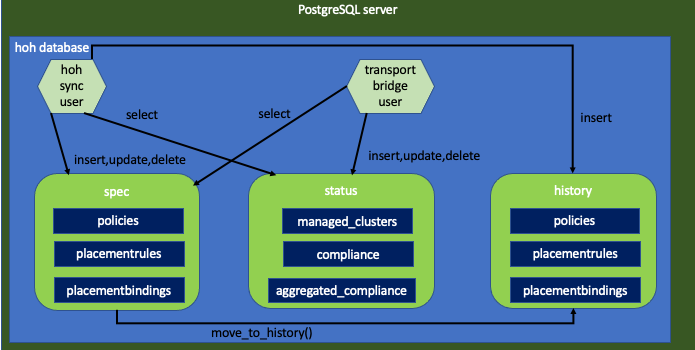

# Install and configure Hub-of-Hubs database

PostgreSQL serves as the database of [Hub-of-Hubs](https://github.com/open-cluster-management/hub-of-hubs) . This repository contains Ansible playbooks to install, configure and uninstall the database. For common commands to work with the database, see [usage.md](usage.md).



## Design points

* We use three schemas: `spec`, `status` and `history`.
* We save Json in `JSONB` fields.
* We use [the same structure](https://github.com/open-cluster-management/hub-of-hubs-postgresql/blob/main/roles/install/tasks/create_spec_table.yaml) for all the tables in the `spec.schema`.
* `status.schema` tables are defined by [this task](roles/install/tasks/create_status_tables.yaml).
* We do not use foreign keys [due to performance considerations](http://bonesmoses.org/2014/05/14/foreign-keys-are-not-free/).

## Initial setup

1.  Create `production` file in the main directory with the host name of your machine to install the database, under the `acm` host group `acm`:

    ```
    [acm]
    <your host>
    ```

1.  Create `vault` file with following variables:
    - `ansible_user`: contains the user of the machine where you install the database
    - `vault_ansible_ssh_private_key_file`: the path to the SSSH private key file to connect to the machine

1.  For formatting multiple lines output, add the following lines to your `ansible.cfg`:

    ```
    # Use the YAML callback plugin.
    stdout_callback = yaml
    # Use the stdout_callback when running ad-hoc commands.
    bin_ansible_callbacks = True
    ```

## To install

Run:

```
ansible-playbook install.yaml -i production --ask-vault-pass -l acm
```

## Post installation tasks

1. Set password for the user `hoh_process_user`:

```
sudo -u postgres psql -c '\password hoh_process_user'
```

1. Obtain a private key and a certificate and put them into `server.key` and `server.crt` files in the PostrgeSQL configuration directory.

1. Configure TLS:

```
ansible-playbook configure_tls.yaml -i production --ask-vault-pass -l acm
```

1. Create `root.crt` on the client machine, put it into `~/.postgresql/root.crt`. For example, for
[Let's encrypt](https://letsencrypt.org/) certificates, run `curl https://letsencrypt.org/certs/trustid-x3-root.pem --output ~/.postgresql/root.crt`.

1. Use `psql` on the client machine:

```
PGSSLMODE=verify-full psql -h <the PostgreSQL VM host> -U hoh_process_user -W -d hoh
```

## To uninstall

Run:

```
ansible-playbook uninstall.yaml -i production --ask-vault-pass -l acm
```

## To drop all the tables

Run:

```
ansible-playbook uninstall.yaml -i production --ask-vault-pass -l acm --tags tables
```

## To recreate the tables:

Run:

```
ansible-playbook install.yaml -i production --ask-vault-pass -l acm --tags tables
```
